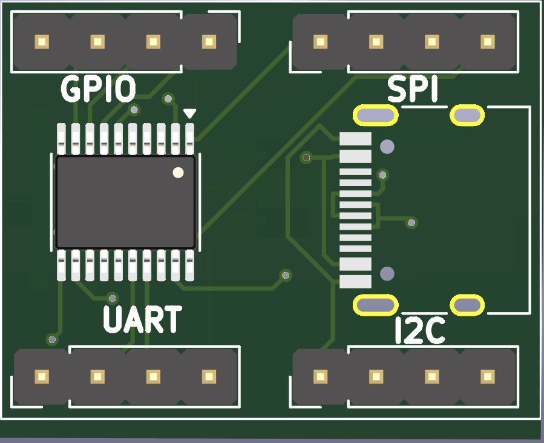
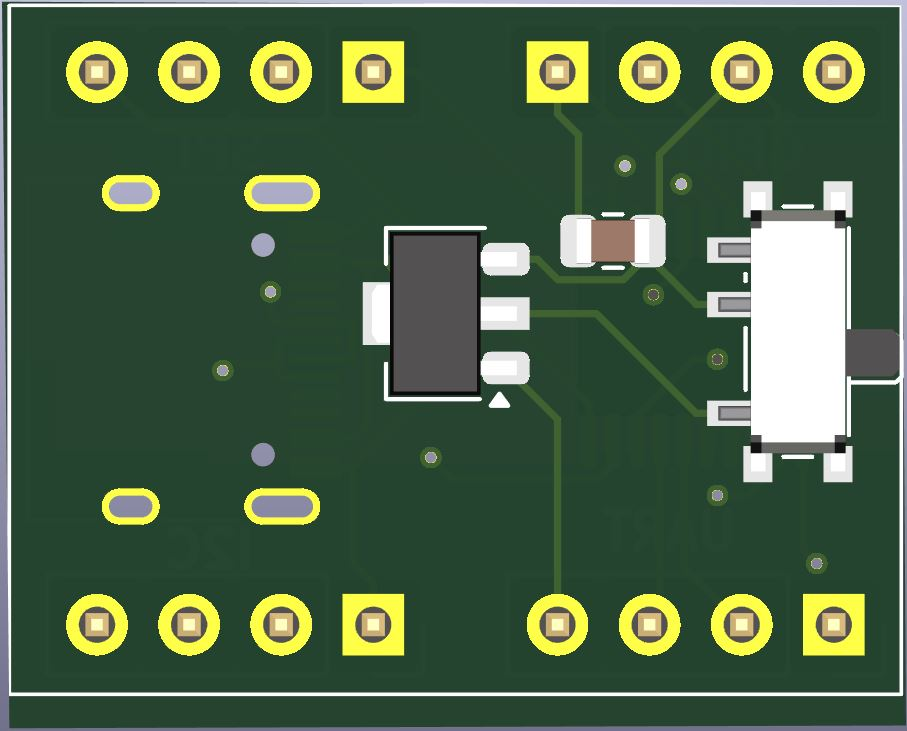
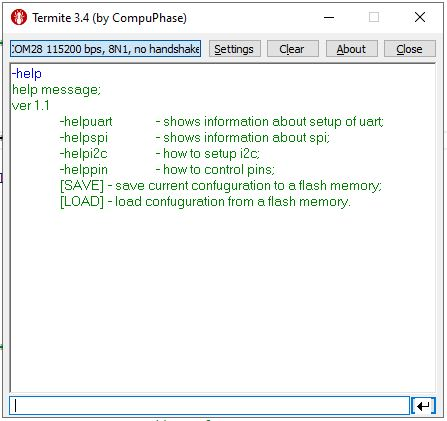
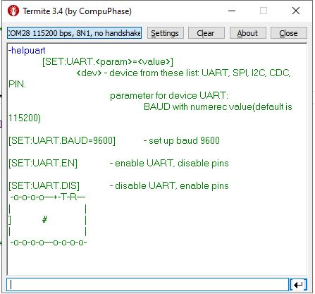
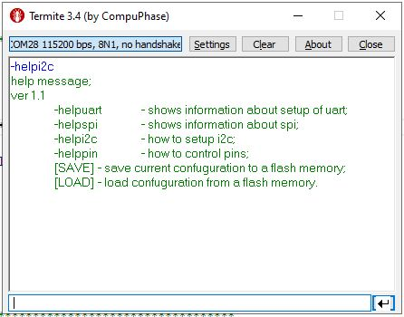
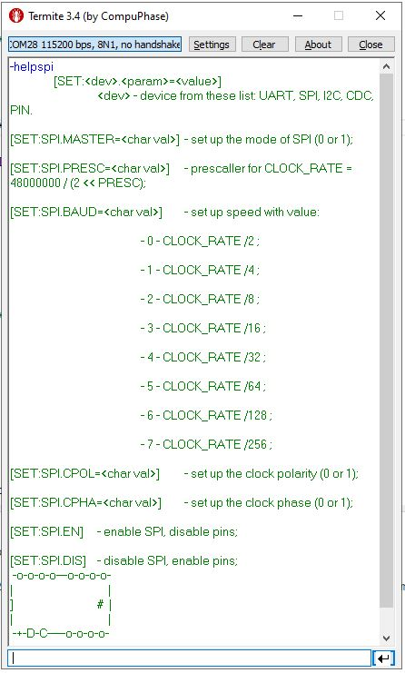
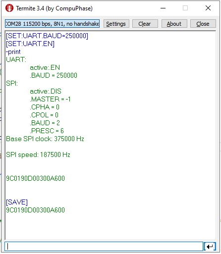

# USB programmable converter based on CH32X033

Using CDC (USB) connection you can

programmatically control interfaces

		

## Current commands
When the device is connected via USB, by connecting a terminal, you can get help on using the control commands. At the end of each command there must be a CR (0x0D) symbol.

### -help
outputs information about possible commands.

#### -print
outputs the current configuration settings

#### [SAVE]

saves the current setting to the flash. On the next powrt connection of the device, this configuration will be automatic activated.

#### -helpuart
commands for configuring the UART interface:

##### [SET:UART.DIS]
makes the UART interface unused.

##### [SET:UART.DIS]
activates the UART interface.

##### [SET:UART.BAUD=<int value>]
Sets the communication speed for the UART interface. <int value> must be a value from 1200 to 2500000 baud per second.
Example: [SET:UART.BAUD=57600] - sets the communication speed to 57600.

{width=300} 

 

